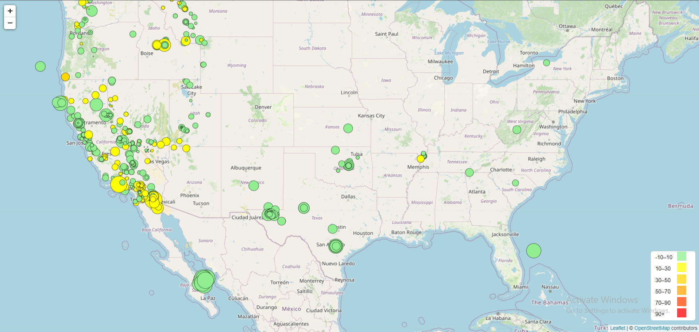

# leaflet-challenge

# Instructions
The instructions for this activity are broken into two parts:

# Scenario 1
Part 1: Create the Earthquake Visualization

Part 2: Gather and Plot More Data (Optional with no extra points earning)

Part 1: Create the Earthquake Visualization

# Scenario 2
Import and visualize the data by doing the following:

Using Leaflet, create a map that plots all the earthquakes from your dataset based on their longitude and latitude.

Your data markers should reflect the magnitude of the earthquake by their size and the depth of the earthquake by color. Earthquakes with higher magnitudes should appear larger, and earthquakes with greater depth should appear darker in color.

Hint: The depth of the earth can be found as the third coordinate for each earthquake.

